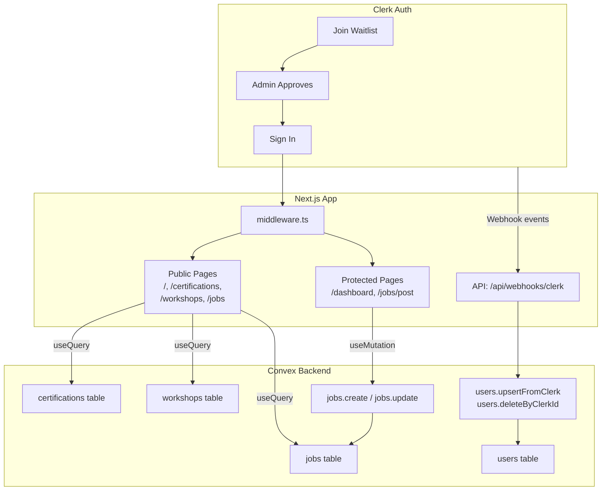

# Sri Sathya Sai Center of Excellence in Actuarial Data Science & AI

## Current State

- **Stack**: Next.js 16, Clerk (`@clerk/nextjs` v6.37), Convex v1.31, Tailwind 4, shadcn (new-york style, neutral base) -- all configured in [package.json](package.json) and [components.json](components.json).
- **Auth**: `ClerkProvider` + `ConvexProviderWithClerk` wired in [app/layout.tsx](app/layout.tsx) and [components/ConvexClientProvider.tsx](components/ConvexClientProvider.tsx). Convex auth provider is **commented out** in [convex/auth.config.ts](convex/auth.config.ts). Clerk middleware exists in [proxy.ts](proxy.ts) but Next.js requires it at `middleware.ts`.
- **Data**: Only a demo `numbers` table in [convex/schema.ts](convex/schema.ts). No users, certifications, workshops, or jobs tables.
- **UI**: No shadcn components installed in `components/ui/`. Page is demo boilerplate.

---

## Phase 1 -- Foundation: Authentication & Waitlist Flow

**Goal**: Wire up Clerk auth properly, enable waitlist-only access (no direct sign-up), and sync Clerk users into Convex.

### 1.1 Fix Clerk Middleware

- **Rename** [proxy.ts](proxy.ts) to `middleware.ts` at project root.
- **Update** route matcher to define public and protected routes:
  - Public: `/`, `/certifications`, `/workshops`, `/jobs`, `/api/webhooks(.*)`.
  - Protected: `/dashboard(.*)`, `/jobs/post`, `/account(.*)`.
- Follow [clerk-nextjs-patterns SKILL](.agents/skills/clerk-nextjs-patterns/SKILL.md) for `clerkMiddleware` + `createRouteMatcher`.

### 1.2 Enable Convex Auth with Clerk

- **Uncomment** the Clerk provider in [convex/auth.config.ts](convex/auth.config.ts):

```typescript
  {
    domain: process.env.CLERK_JWT_ISSUER_DOMAIN,
    applicationID: "convex",
  }


```

- Ensure `CLERK_JWT_ISSUER_DOMAIN` is set in the Convex dashboard environment variables (this is the Clerk Frontend API URL, e.g. `https://your-app.clerk.accounts.dev`).

### 1.3 Clerk Dashboard: Enable Waitlist & Restricted Sign-Up

- In Clerk Dashboard: **User & Authentication -> Restrictions** -- enable **Restricted** sign-up mode so nobody can self-register.
- Enable **Waitlist** feature in Clerk Dashboard.
- This means: visitors can only "Join Waitlist". Once approved by admin in Clerk, they receive an invite and can then sign in.

### 1.4 Waitlist UI in the App

- **Remove** `SignUpButton` from the app entirely.
- **Add** a "Join Waitlist" button/form on the homepage and a dedicated waitlist CTA. Clerk provides a `<Waitlist />` component, or you can build a custom form.
- **Keep** `SignInButton` for already-approved users.

### 1.5 Skills Used

- [clerk-setup SKILL](.agents/skills/clerk-setup/SKILL.md) -- quickstart patterns
- [clerk-nextjs-patterns SKILL](.agents/skills/clerk-nextjs-patterns/SKILL.md) -- middleware, `await auth()`, `<Show>` component
- [clerk-custom-ui SKILL](.agents/skills/clerk-custom-ui/SKILL.md) -- if custom waitlist/sign-in styling is desired

---

## Phase 2 -- Convex Data Model & User Sync

**Goal**: Define the full Convex schema and set up Clerk webhook to sync users into Convex on create/update/delete.

### 2.1 Convex Schema ([convex/schema.ts](convex/schema.ts))

Replace the demo `numbers` table with the production schema:

```typescript
import { defineSchema, defineTable } from "convex/server";
import { v } from "convex/values";

export default defineSchema({
  users: defineTable({
    clerkId: v.string(),
    email: v.string(),
    username: v.optional(v.string()),
    name: v.string(),
    imageUrl: v.optional(v.string()),
    role: v.union(v.literal("member"), v.literal("employer")),
    approvedAt: v.optional(v.number()),
  })
    .index("by_clerkId", ["clerkId"])
    .index("by_role", ["role"]),

  certifications: defineTable({
    title: v.string(),
    slug: v.string(),
    description: v.string(),
    highlight: v.boolean(),
    order: v.number(),
    imageUrl: v.optional(v.string()),
  }).index("by_slug", ["slug"]),

  workshops: defineTable({
    title: v.string(),
    slug: v.string(),
    description: v.string(),
    date: v.optional(v.string()),
    location: v.optional(v.string()),
    status: v.union(
      v.literal("upcoming"),
      v.literal("ongoing"),
      v.literal("completed"),
    ),
    order: v.number(),
    imageUrl: v.optional(v.string()),
  }).index("by_slug", ["slug"]),

  jobs: defineTable({
    title: v.string(),
    description: v.string(),
    employerId: v.id("users"),
    company: v.string(),
    location: v.string(),
    type: v.union(
      v.literal("full-time"),
      v.literal("part-time"),
      v.literal("contract"),
      v.literal("internship"),
    ),
    status: v.union(
      v.literal("draft"),
      v.literal("published"),
      v.literal("closed"),
    ),
  })
    .index("by_employerId", ["employerId"])
    .index("by_status", ["status"]),
});
```

### 2.2 Clerk Webhook -> Convex User Sync

Two files needed:

`**app/api/webhooks/clerk/route.ts**` -- Next.js API route:

- Uses `verifyWebhook(req)` from `@clerk/nextjs/webhooks` (per [clerk-webhooks SKILL](.agents/skills/clerk-webhooks/SKILL.md)).
- Handles events: `user.created`, `user.updated`, `user.deleted`.
- On `user.created` / `user.updated`: calls a Convex mutation (`users.upsertFromClerk`) passing `clerkId`, `email`, `name`, `imageUrl`, and `role` (derived from Clerk public metadata or defaulting to `"learner"`).
- On `user.deleted`: calls a Convex mutation (`users.deleteByClerkId`).
- Returns `200` immediately.

`**convex/users.ts**` -- Convex mutations:

- `upsertFromClerk` (internalMutation): looks up user by `clerkId` index; inserts or patches.
- `deleteByClerkId` (internalMutation): finds and deletes user by `clerkId`.
- `getByClerkId` (query): public query used by the app to fetch the current user's Convex profile.

### 2.3 Clerk Dashboard Webhook Setup

- Add endpoint URL: `https://<your-domain>/api/webhooks/clerk`
- Subscribe to events: `user.created`, `user.updated`, `user.deleted`
- Copy the `CLERK_WEBHOOK_SIGNING_SECRET` to `.env.local`
- Ensure `middleware.ts` does **not** protect `/api/webhooks(.*)`.

### 2.4 Middleware Update for Webhook

Update `middleware.ts` to make webhook routes public:

```typescript
const isPublicRoute = createRouteMatcher([
  "/",
  "/certifications(.*)",
  "/workshops(.*)",
  "/jobs",
  "/jobs/(.*)", // job detail pages
  "/api/webhooks(.*)", // Clerk webhooks -- must be public
  "/sign-in(.*)",
  "/sign-up(.*)",
]);
```

### 2.5 Skills Used

- [clerk-webhooks SKILL](.agents/skills/clerk-webhooks/SKILL.md) -- `verifyWebhook`, event handling, making route public
- Convex rules (from [.cursor/rules/convex_rules.mdc](.cursor/rules/convex_rules.mdc)) -- schema, mutations, indexes

---

## Phase 3 -- Routing & Layout (All Pages)

**Goal**: Build the app shell (header, footer, navigation) and stub out all routes with a maintainable, expandable structure.

### 3.1 Route Structure

```
app/
  layout.tsx              -- Root layout (providers, fonts, metadata)
  page.tsx                -- Landing / Home page
  globals.css             -- Theme + Tailwind

  (marketing)/
    layout.tsx            -- Shared header + footer for public pages
    certifications/
      page.tsx            -- All certifications (AI Actuaries highlighted)
    workshops/
      page.tsx            -- All workshops
    jobs/
      page.tsx            -- Public job listings
      [id]/
        page.tsx          -- Single job detail

  (dashboard)/
    layout.tsx            -- Auth-protected layout with sidebar or user nav
    dashboard/
      page.tsx            -- User dashboard (enrolled certs, waitlist status)
    jobs/
      post/
        page.tsx          -- Employer: post a new job
    account/
      page.tsx            -- Account settings

  sign-in/[[...sign-in]]/
    page.tsx              -- Clerk sign-in page

  api/
    webhooks/
      clerk/
        route.ts          -- Clerk webhook handler
```

**Why route groups**: `(marketing)` and `(dashboard)` are Next.js route groups -- they share layouts without affecting the URL. Public pages get one layout (nav + footer), dashboard pages get another (auth-guarded, different nav). This makes it trivial to add new marketing or dashboard pages.

### 3.2 Shared App Shell

**Header component** (`components/layout/header.tsx`):

- Logo / site name
- Nav links: Home, Certifications, Workshops, Jobs
- Auth area: `<Show when="signed-in">` -> `<UserButton />`, fallback -> "Join Waitlist" + "Sign In" buttons
- Mobile: shadcn `Sheet` component for hamburger menu

**Footer component** (`components/layout/footer.tsx`):

- Site name, copyright, links (About, Contact, Privacy)
- Keep minimal and easy to extend

### 3.3 Install Required shadcn Components

```
npx shadcn@latest add button card badge input textarea select sheet dropdown-menu separator avatar dialog form label navigation-menu tabs
```

### 3.4 Skills Used

- [vercel-react-best-practices SKILL](.agents/skills/vercel-react-best-practices/SKILL.md) -- Server Components by default, Suspense boundaries, avoid barrel imports

---

## Phase 4 -- Pages: Content & Features

**Goal**: Implement the actual content for each page.

### 4.1 Landing Page ([app/page.tsx](app/page.tsx))

- **Hero section**: Institution name, tagline ("Pioneering the future of Actuarial Science through AI and Data Science"), CTA buttons ("Explore Certifications" + "Join Waitlist")
- **Highlights section**: 3-4 cards -- Certifications count, Workshops count, "Powered by AI", Job opportunities
- **Featured Certification**: AI Actuaries Certification with prominent card
- **Call to Action**: Waitlist enrollment

### 4.2 Certifications Page (`app/(marketing)/certifications/page.tsx`)

- Fetch from Convex `certifications` table (or static data initially)
- **AI Actuaries Certification** as hero card (full-width, distinct accent color, `highlight: true`)
- Other certifications in a responsive grid of shadcn `Card` components
- Each card: title, description, badge for status, CTA button

### 4.3 Workshops Page (`app/(marketing)/workshops/page.tsx`)

- Fetch from Convex `workshops` table
- Grid/list of workshop cards with: title, description, date, location, status badge (upcoming/ongoing/completed)
- Filter tabs by status using shadcn `Tabs`

### 4.4 Jobs Page (`app/(marketing)/jobs/page.tsx`)

- Fetch published jobs from Convex `jobs.listPublished` query
- Grid of job cards: title, company, location, type badge, posted date
- Optional: search/filter by type or location

### 4.5 Job Detail (`app/(marketing)/jobs/[id]/page.tsx`)

- Full job description, employer info, apply CTA (link or contact email)

### 4.6 Post Job -- Employer Only (`app/(dashboard)/jobs/post/page.tsx`)

- Protected route (middleware + runtime check for `role === "employer"`)
- Form: title, description, company, location, type (select), submit
- On submit: Convex `jobs.create` mutation
- Validate that `ctx.auth.getUserIdentity()` exists and user has employer role in Convex

### 4.7 User Dashboard (`app/(dashboard)/dashboard/page.tsx`)

- Simple overview: welcome message, role, enrolled certifications (future), posted jobs (if employer)
- Expandable later with enrollment tracking, progress, etc.

---

## Phase 5 -- Design & Polish

**Goal**: Apply a cohesive, modern design system following the [frontend-design SKILL](.agents/skills/frontend-design/SKILL.md).

### 5.1 Design Direction

- **Tone**: Refined professional with warmth -- an educational institution that is modern and tech-forward
- **Color Palette**: Deep navy/indigo primary (#1e293b or similar), warm amber/gold accent (#f59e0b), clean off-white background, with high contrast for readability
- **Typography**: A distinctive display font (e.g. Playfair Display, DM Serif Display, or Fraunces) for headings paired with a clean sans-serif (e.g. DM Sans, Plus Jakarta Sans) for body. Load via `next/font/google` in [app/layout.tsx](app/layout.tsx).
- **Differentiator**: The AI Actuaries certification gets a subtle animated gradient badge/border to make it stand out

### 5.2 Theme Variables

Update [app/globals.css](app/globals.css) CSS variables to match the chosen palette. shadcn components will automatically inherit these.

### 5.3 Motion & Micro-interactions

- Staggered reveal on scroll for card grids (CSS `animation-delay`)
- Subtle hover lift on cards (`transform: translateY(-2px)` + shadow)
- Smooth page transitions via Next.js (or simple CSS transitions)
- Keep it tasteful -- one or two high-impact moments, not scattered animation

### 5.4 Responsive Design

- Mobile-first approach; all pages work on 320px+
- Header collapses to hamburger (shadcn `Sheet`)
- Cards go from grid to single column on small screens

### 5.5 Accessibility

- Semantic HTML (`nav`, `main`, `section`, `article`, `h1`-`h3`)
- Focus-visible states on all interactive elements (shadcn provides this)
- Color contrast meets WCAG AA
- Alt text on images

### 5.6 Performance (per [vercel-react-best-practices SKILL](.agents/skills/vercel-react-best-practices/SKILL.md))

- Server Components by default; only mark components `"use client"` when they need interactivity
- Parallel data fetching with component composition (avoid waterfall)
- `Suspense` boundaries with loading skeletons for data-dependent sections
- Avoid barrel imports for `lucide-react` (use direct imports or `optimizePackageImports`)
- Minimize serialization at RSC boundaries

---

## Phase 6 -- Additional Features & Hardening

**Goal**: Features that round out the platform.

### 6.1 Seed Data Script

- Create `convex/seed.ts` with initial certifications and workshops data
- Run via `npx convex run seed:seedData` for quick bootstrapping

### 6.2 Role Management

- Employers get their role via Clerk public metadata (`{ role: "employer" }`) set by admin in Clerk Dashboard
- The webhook handler reads `publicMetadata.role` and syncs it to Convex `users.role`
- Default role for new users: `"learner"`

### 6.3 Employer Job Management

- `app/(dashboard)/jobs/manage/page.tsx` -- employers see their posted jobs, can edit status (draft/published/closed)

### 6.4 Email Notifications (Future)

- Leverage Clerk `waitlistEntry.created` webhook to track waitlist entries
- Optional: send custom emails on approval

### 6.5 Admin Features (Future)

- Admin dashboard for managing waitlist approvals, certifications, workshops content
- Could use Clerk Organizations or a simple `role: "admin"` check

### 6.6 SEO & Metadata

- Proper `metadata` exports on each page (title, description, Open Graph)
- Update [app/layout.tsx](app/layout.tsx) metadata with institution name

### 6.7 Error & Loading States

- `app/not-found.tsx` -- custom 404 page
- `loading.tsx` files in route groups for streaming Suspense fallbacks
- `error.tsx` for graceful error boundaries

---

## Architecture Diagram



---

## Implementation Order Summary

1. **Phase 1** (Auth): Rename `proxy.ts` -> `middleware.ts` -> configure routes -> uncomment Convex auth -> Clerk Dashboard (waitlist + restricted) -> remove SignUp, add Waitlist
2. **Phase 2** (Data): Full Convex schema -> webhook route -> user sync mutations -> test user creation flow
3. **Phase 3** (Routing): Route group structure -> install shadcn components -> header + footer -> stub all pages
4. **Phase 4** (Content): Landing page -> certifications -> workshops -> jobs listing -> post job -> dashboard
5. **Phase 5** (Design): Color palette + typography in globals.css -> component styling -> animations -> responsive -> a11y
6. **Phase 6** (Extras): Seed data -> role management -> employer job management -> SEO -> error states

Each phase is independently deployable. Phase 1-2 are foundational and should be done first. Phases 3-5 can overlap. Phase 6 is iterative.
