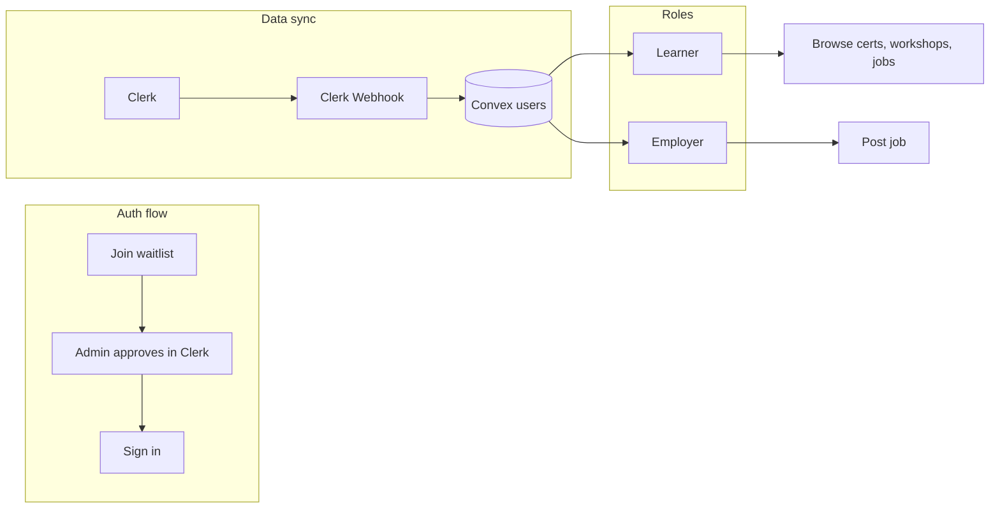

# Sri Sathya Sai Center of Excellence – Education Website Plan

## Current state

- **Stack**: Next.js 16, Clerk (@clerk/nextjs v6), Convex, Tailwind 4, shadcn (new-york, neutral base) configured in [components.json](components.json).
- **Auth**: [ClerkProvider](app/layout.tsx) and [ConvexProviderWithClerk](components/ConvexClientProvider.tsx) are wired; Convex [auth.config.ts](convex/auth.config.ts) has Clerk provider commented out; [proxy.ts](proxy.ts) contains Clerk middleware (Next.js expects `middleware.ts` at root—rename or consolidate).
- **Data**: Convex [schema](convex/schema.ts) has only `numbers`; no users table or Clerk webhook sync yet.
- **UI**: [globals.css](app/globals.css) has shadcn theme variables; no shadcn UI components installed under `components/ui` yet.

---

## Phase 1: Foundation, auth, and user sync

**Goal**: Design system, Convex–Clerk auth, waitlist-only access, and syncing users into Convex.

### 1.1 Design system and shadcn

- **Palette**: Pick a clear direction (e.g. refined/professional or warm/educational). Use [frontend-design SKILL](.agents/skills/frontend-design/SKILL.md): distinctive typography (display + body), CSS variables in [app/globals.css](app/globals.css), dominant color + accent. Avoid generic purple-on-white; keep contrast and accessibility.
- **shadcn**: Add core components used across the app (e.g. `Button`, `Card`, `Input`, `Badge`, `Sheet` or `DropdownMenu` for nav). Use `npx shadcn@latest add <component>` so theme variables drive styling.

### 1.2 Convex schema and Clerk auth

- **Schema** in [convex/schema.ts](convex/schema.ts):
  - **users**: `clerkId`, `email`, `name`, `imageUrl`, `role` (`"learner"` | `"employer"`), optional `approvedAt` (for waitlist approval). Index by `clerkId`.
  - Optionally **waitlistEntries**: if you store waitlist in Convex (e.g. `email`, `name`, `clerkWaitlistEntryId`, `status`). Otherwise rely on Clerk Waitlist + webhook `waitlistEntry.` to only sync when users are created.
- **Convex auth**: Uncomment and set Clerk provider in [convex/auth.config.ts](convex/auth.config.ts) with `domain: process.env.CLERK_JWT_ISSUER_DOMAIN`, `applicationID: "convex"`. Set `CLERK_JWT_ISSUER_DOMAIN` in Convex dashboard (Clerk Frontend API URL). Run `npx convex dev` to sync.

### 1.3 Clerk webhook → Convex user sync

- **HTTP route**: Add Convex HTTP router in `convex/http.ts` with a **public** POST route (e.g. `/clerk-webhook`) that:
  - Verifies request using `verifyWebhook(req)` from `@clerk/nextjs/webhooks` (see [clerk-webhooks SKILL](.agents/skills/clerk-webhooks/SKILL.md)).
  - Handles `user.created`, `user.updated`, `user.deleted` (and optionally `waitlistEntry.created` / `waitlistEntry.updated` if you store waitlist in Convex).
  - On `user.created`/`user.updated`: call an internal Convex mutation to upsert `users` by `clerkId` (map Clerk user fields to your schema). On `user.deleted`: delete or soft-delete the user.
- **Clerk Dashboard**: Add endpoint URL (e.g. `https://<your-convex-site>.convex.site/clerk-webhook`), set `CLERK_WEBHOOK_SIGNING_SECRET` in Convex env, subscribe to the chosen events.
- **Middleware**: Ensure the webhook path is **not** protected by Clerk (so Clerk can POST without auth). If middleware lives in [proxy.ts](proxy.ts), either rename to `middleware.ts` or add a root `middleware.ts` that delegates; in both cases, exclude the Convex HTTP URL or your Next.js proxy to that URL from auth.

### 1.4 Waitlist-only access (no direct sign-up)

- **Clerk Dashboard**: Enable **Waitlist** (User & Authentication → Waitlist). Use **Restricted** or invite-only sign-up so only people you approve get accounts (see [Clerk restricted mode](https://clerk.com/changelog/2024-09-30-restricted-sign-up-mode)).
- **App UX**:
  - **No self-service sign-up**: Hide or remove `SignUpButton`; show “Join waitlist” (Clerk `<Waitlist />` or custom form that uses Clerk’s waitlist).
  - **Sign-in only**: Show SignInButton for users who already have an account (invited/approved). Use [clerk-custom-ui](.agents/skills/clerk-custom-ui/SKILL.md) if you want a custom waitlist/sign-in UI.
- **Optional**: Store waitlist in Convex via `waitlistEntry.` webhook and show a simple “You’re on the list” state; when you approve users in Clerk, they can sign in and then appear in Convex via `user.created`/`user.updated`.

### 1.5 Middleware and protected routes

- Use a single root [middleware.ts](middleware.ts) (or rename [proxy.ts](proxy.ts)) with `clerkMiddleware`, `createRouteMatcher`. Keep `/`, `/certifications`, `/workshops`, `/jobs` (listing) public; protect routes like `/dashboard`, `/jobs/post` (employer), and any “account required” pages. Keep `/api/webhooks` (if you proxy Clerk to Next.js) or the Convex HTTP path public.

**Phase 1 deliverables**: Themed app shell (optional minimal header), Convex users table populated via webhook, waitlist-only entry + sign-in only, protected routes defined.

---

## Phase 2: Core content – Certifications and Workshops

**Goal**: Simple, scalable pages for Certifications (with AI Actuaries highlight) and Workshops.

### 2.1 App shell and navigation

- **Layout**: Shared header (logo, nav: Home, Certifications, Workshops, Jobs, Sign in / UserButton) and footer. Use shadcn components (e.g. `Sheet` for mobile menu, `Button`/links). Keep layout in [app/layout.tsx](app/layout.tsx) or a shared layout under `app`.
- **Navigation**: Simple list of links; active state via pathname. No heavy client state.

### 2.2 Landing page

- **Route**: [app/page.tsx](app/page.tsx). Hero with center name and tagline; short sections: “Certifications”, “Workshops”, “Join waitlist” CTA. Use Card/Badge for highlights. Keep structure minimal so you can add sections later without refactors.

### 2.3 Certifications page

- **Route**: `app/certifications/page.tsx`.
- **Content**: List of certification programs. **AI Actuaries Certification** as the hero/feature card (distinct styling, primary CTA). Others in a simple grid/list. Data can be static (e.g. constants or a Convex table `certifications`: `title`, `slug`, `description`, `highlight: boolean`, `order`). Use shadcn Card, Badge, Button.

### 2.4 Workshops page

- **Route**: `app/workshops/page.tsx`.
- **Content**: List of workshops (title, short description, date/location if desired). Convex table `workshops` or static data; same pattern as certifications for consistency and future CMS.

**Phase 2 deliverables**: Public landing, Certifications (AI Actuaries highlighted), Workshops, reusable cards and layout.

---

## Phase 3: Jobs and employer accounts

**Goal**: Employers (with accounts) can post jobs; job listings are visible.

### 3.1 Employer role

- **Identity**: Store `role` in Convex `users` (synced from Clerk). Set `role: "employer"` when creating/inviting employer users (Clerk Dashboard or Backend API), or via public metadata that the webhook copies to Convex.
- **Convex**: In mutations that “post job”, require `ctx.auth.getUserIdentity()` and that the corresponding `users` row has `role === "employer"`.

### 3.2 Jobs data and API

- **Schema**: Table `jobs`: `title`, `description`, `employerId` (Id<"users">), `location`, `type` (full-time/part-time/etc.), `status` (draft/published), `_creationTime`. Index by `employerId`, `status`.
- **Convex**: `jobs.list` (query): list published jobs (and optionally filter). `jobs.create` / `jobs.update` (mutations): only for authenticated user with `role === "employer"`; set `employerId` to current user’s Convex user id (resolve from identity).

### 3.3 Jobs UI

- **Listing**: `app/jobs/page.tsx` – public list of published jobs (cards with title, employer, location, type). Use Convex `useQuery(api.jobs.list)`.
- **Post job**: `app/jobs/post/page.tsx` (or `/jobs/new`) – protected; show form only if current user is employer. On submit, call `jobs.create`. Use shadcn Form components if available (or Input, Button, Card).
- **Optional**: `app/jobs/[id]/page.tsx` for job detail and “Apply” (e.g. collect email or link to external form).

**Phase 3 deliverables**: Employers can sign in and post jobs; public job list; role enforced in Convex.

---

## Phase 4: Polish and scalability

**Goal**: Consistent design, accessibility, and performance; keep pages easy to extend.

- **Design pass**: Apply [frontend-design SKILL](.agents/skills/frontend-design/SKILL.md) for typography, spacing, and one or two high-impact motions (e.g. hover, staggered reveal on scroll). Ensure palette works in light/dark if you support dark mode.
- **Performance**: Follow [vercel-react-best-practices SKILL](.agents/skills/vercel-react-best-practices/SKILL.md): avoid waterfalls (parallel fetches, Suspense where useful), minimal RSC payload, no barrel imports for heavy libs.
- **Accessibility**: Semantic HTML, focus states on interactive elements (shadcn helps), basic ARIA where needed.
- **Scalability**: One route per feature (e.g. one page per certification slug later); keep components small and data shape simple so you can add CMS or more Convex tables without big refactors.

---

## Skills to use per phase

| Phase | Skills                                                                                                |
| ----- | ----------------------------------------------------------------------------------------------------- |
| 1     | clerk-setup, clerk-webhooks, clerk-nextjs-patterns (middleware), frontend-design (palette/typography) |
| 2     | frontend-design (layout, components), vercel-react-best-practices                                     |
| 3     | clerk (roles via metadata), vercel-react-best-practices                                               |
| 4     | frontend-design, vercel-react-best-practices                                                          |

---

## High-level flow

---

## Implementation order summary

1. **Phase 1**: Design tokens + shadcn → Convex schema (users) → Convex auth.config → Clerk webhook handler in Convex → Clerk Dashboard webhook + Waitlist/Restricted → Middleware (middleware.ts) → Remove sign-up, add waitlist + sign-in.
2. **Phase 2**: App shell (header/footer) → Landing → Certifications (data + AI Actuaries highlight) → Workshops (data + list).
3. **Phase 3**: Employer role in sync → jobs schema + Convex functions → Jobs list page → Post job (protected) page.
4. **Phase 4**: Design polish, a11y, performance checks.

Keeping each page focused (single purpose, clear data source) will make it easy to scale and maintain.
