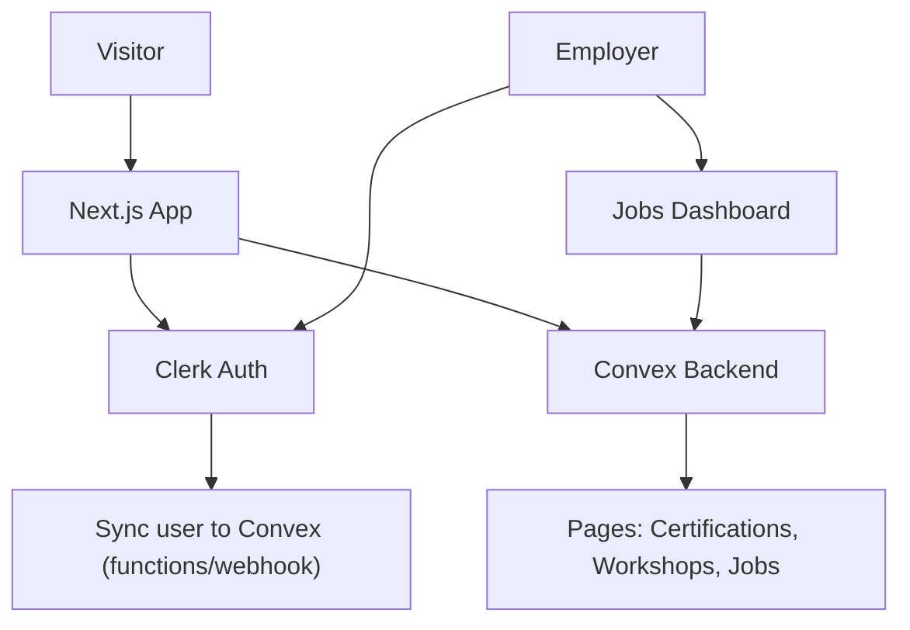

## High-level architecture

- **Stack**: Next.js App Router (TypeScript, React Server Components), Convex as backend/database, Clerk for authentication.
- **Auth model**: Public marketing pages; users cannot self-sign-up. They submit a **waitlist form**; admins approve and trigger Clerk invitations. Employers must have an approved account to post jobs.
- **Data**: All user profiles (students and employers), waitlist entries, certifications, workshops, and jobs stored in Convex. Clerk user data is synced into Convex on first login or via a webhook.
- **Design**: Modern, minimal-but-bold layout with a distinct color system (e.g., deep indigo + warm gold accent + off-white backgrounds) and strong typography. Shared layout components and Tailwind (or CSS modules) for consistency.

## Phase 1: Project foundation & visual system

- **Routing & layout**
  - Set up base layout in `[app/layout.tsx](app/layout.tsx)` with site-wide header, footer, and responsive container.
  - Define primary navigation: `Home`, `Certifications`, `Workshops`, `Jobs`, `About` (or `Center`), `Contact`/`Waitlist`.
  - Create basic pages: `[app/page.tsx](app/page.tsx)` (home), `[app/certifications/page.tsx](app/certifications/page.tsx)`, `[app/workshops/page.tsx](app/workshops/page.tsx)`, `[app/jobs/page.tsx](app/jobs/page.tsx)`, `[app/waitlist/page.tsx](app/waitlist/page.tsx)`.
- **Design system**
  - Establish global styles in `[app/globals.css](app/globals.css)` or Tailwind config: color variables (e.g., `--bg-deep-navy`, `--accent-gold`, `--muted-sand`), font stacks (distinct display font for headings, clean serif/sans for body), spacing scale, and border radii.
  - Build core UI primitives in `components/`: `Button`, `Card`, `Section`, `PageHeader`, `Tag`, and a simple `Grid` layout, following Vercel React best practices (minimal client components, avoid heavy client-only logic on initial pages).
- **Home page content**
  - In `[app/page.tsx](app/page.tsx)`, design a hero section tailored to "Sri Sathya Sai Center of Excellence in Actuarial Data Science & AI" with value props, highlight the **AI Actuaries Certification**, and a prominent **Join Waitlist** CTA.
  - Add simple teaser sections for Certifications, Workshops, and Jobs (each linking to its page) and a short mission/values section.

## Phase 2: Authentication & waitlist flow (no direct signup)

- **Integrate Clerk for auth**
  - Confirm Next.js + `@clerk/nextjs` in `package.json`, then follow Clerk Next.js quickstart: wrap the app in `ClerkProvider` inside `[app/layout.tsx](app/layout.tsx)` and configure `NEXT_PUBLIC_CLERK_PUBLISHABLE_KEY` / `CLERK_SECRET_KEY` in `.env.local`.
  - Add auth routes (e.g., `[app/sign-in/[[...sign-in]]/page.tsx](app/sign-in/[[...sign-in]]/page.tsx)`) using Clerk components, customizing appearance to match your color palette and typography.
- **Waitlist-first signup model**
  - Create a **waitlist form** (public) on `[app/waitlist/page.tsx](app/waitlist/page.tsx)` with fields like name, email, role (student/employer/other), interest (AI Actuaries Certification / Workshops / Jobs), and optional background info.
  - On submit, call a Convex mutation (e.g., `convex/waitlist.ts`) to store the request and mark status as `pending`.
  - Do **not** expose public sign-up links; hide or guard `/sign-up` so that only **invited** users can complete sign-up (e.g., using Clerk invitation links or protected access codes).
- **Auth gating patterns**
  - Use `@clerk/nextjs/server` `auth()` in server components (e.g., in `[app/(protected)/dashboard/page.tsx]`) and `useAuth()`/`<SignedIn>/<SignedOut>` in client components where necessary.
  - Define a simple pattern for protected routes: e.g., grouping authenticated pages under `app/(protected)/` and using middleware to require auth there while keeping marketing pages public.

## Phase 3: Convex data model & user syncing

- **Convex schema & functions**
  - Define tables in Convex schema (e.g., in `convex/schema.ts`): `users`, `waitlistEntries`, `certifications`, `workshops`, `jobs`, `employerProfiles`.
  - Implement Convex queries/mutations in files like `convex/users.ts`, `convex/waitlist.ts`, `convex/content.ts`, `convex/jobs.ts` for basic CRUD and listing.
- **User sync pattern**
  - Implement a Convex mutation (e.g., `syncUserFromClerk`) that upserts a user record keyed by `clerkUserId`, storing name, email, role, and any custom metadata.
  - Add a small **server-side hook** in a protected layout or `ConvexClientProvider` consumer that, after `auth()` returns an active user, calls the `syncUserFromClerk` mutation once per session (e.g., via a lightweight client component with `useEffect` + `useMutation` guarded to run only when needed).
  - Optionally, plan for a **Clerk webhook** endpoint (Next.js route handler) that listens for `user.created` / `user.updated` events and invokes the same Convex mutation for background syncing.
- **Role handling**
  - Extend Convex `users` table with a `role` field (`student`, `employer`, `admin`) and keep it in sync with Clerk user metadata or public metadata.
  - Ensure all protected Convex functions check role and `auth()` context so only employers can create jobs and only admins can approve waitlist entries.

## Phase 4: Content pages – Certifications & Workshops

- **Certifications**
  - Model certifications in Convex (`certifications` table) with fields like `slug`, `title`, `highlight` (boolean), `description`, `syllabus`, `duration`, `level`, `ctaLabel`.
  - On `[app/certifications/page.tsx](app/certifications/page.tsx)`, build a server component that queries Convex for the list and renders modern cards, prominently featuring the **AI Actuaries Certification** (e.g., first card or separate highlight section).
  - Link each certification to a detail route `[app/certifications/[slug]/page.tsx](app/certifications/[slug]/page.tsx)` that pulls full details from Convex and includes CTAs: "Join Waitlist" (students) or "Request Info".
- **Workshops**
  - Model workshops (`workshops` table) with schedule, mode (online/offline), capacity, and tags.
  - On `[app/workshops/page.tsx](app/workshops/page.tsx)`, show upcoming workshops as cards with date badges and a simple filter (by track or level). CTAs should funnel to the same waitlist or a logged-in registration (future phase).
- **Design consistency**
  - Reuse `PageHeader`, `Card`, and `Section` components so pages remain simple, scalable, and easy to maintain.
  - Apply performance best practices: data fetching in server components, parallel Convex queries where needed, and minimal client-side state.

## Phase 5: Jobs board & employer experience

- **Public jobs listing**
  - On `[app/jobs/page.tsx](app/jobs/page.tsx)`, implement a public jobs list powered by a Convex query filtering `jobs` by status (`published`).
  - Show job title, employer name, location/remote, and a short summary. Detail pages at `[app/jobs/[id]/page.tsx](app/jobs/[id]/page.tsx)` pull full job descriptions from Convex.
- **Employer accounts & posting**
  - Create an authenticated employer dashboard under e.g. `app/(protected)/employer/page.tsx` that requires `role === 'employer'` checked via `auth()` + Convex user record.
  - In the dashboard, add a simple job creation/editing interface using client components that call Convex mutations (`createJob`, `updateJob`, `archiveJob`).
  - Ensure employers are onboarded via the waitlist: admin reviews `waitlistEntries` (see next phase), marks them approved, and either sets `role=employer` in Convex/Clerk metadata or sends a Clerk invitation with the employer flag.
- **Application handling (optional first cut)**
  - Initially, keep job applications simple: a `Apply via email` CTA or a basic Convex-backed application form that just sends an email + stores minimal application data.
  - Plan later enhancements (full applicant tracking) as a follow-on phase.

## Phase 6: Admin tools & moderation

- **Admin role & access control**
  - Define `admin` users in Convex (and optionally Clerk metadata) and gate admin UI under `app/(protected)/admin/...`, checking both `auth()` and Convex user `role`.
- **Waitlist management**
  - Build an admin UI page (e.g., `[app/(protected)/admin/waitlist/page.tsx](app/(protected)/admin/waitlist/page.tsx)`) listing `waitlistEntries` from Convex.
  - Allow admins to approve/decline entries; on approval, trigger either:
    - A Convex function that calls Clerk Backend API to create/invite a user, or
    - A manual process (download CSV/view details) in early phases, with a clear plan to automate later.
- **Content/admin controls**
  - Provide simple Convex-backed admin views to manage certifications, workshops, and jobs (CRUD screens using shared admin table/list components).
  - Enforce authorization checks in Convex mutations to ensure only admins can modify academic content and only employers can modify their own jobs.

## Phase 7: Polish, performance, and future extensions

- **UI polish & branding**
  - Iterate on typography, spacing, and motion: subtle hover states on cards, smooth scroll reveals for hero/sections, and tasteful gradients/background textures aligned with the Center’s identity.
  - Customize Clerk Sign-In/Sign-Up appearance with `appearance` props (colors, border radius, logo) to match the main site.
- **Performance & reliability**
  - Audit data fetching according to Vercel best practices: avoid waterfalls, use server components for Convex reads, and memoize expensive client components when needed.
  - Add basic analytics and error monitoring integrations (lazy-load them to avoid impacting initial bundle).
- **Future enhancements**
  - Student dashboards (track progress across certifications/workshops), automated certificate issuance, richer employer branding pages, and AI-powered guidance (e.g., personalised learning paths for actuarial data science & AI).
